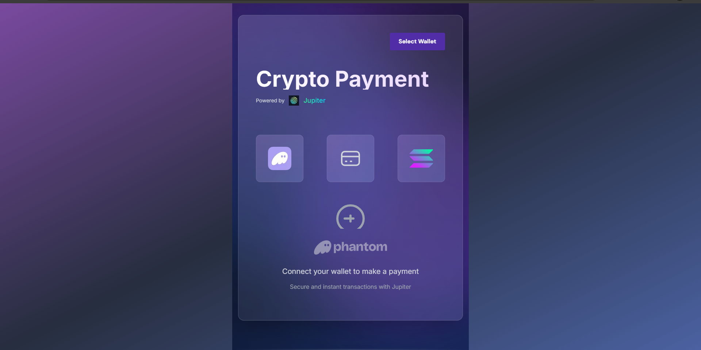

# Payment Gateway Jupiter

A modern, user-friendly cryptocurrency payment gateway built with Next.js and Jupiter Protocol on the Solana blockchain. This application provides a seamless interface for processing crypto payments with a beautiful, responsive design.



## Features

- 🎨 Modern UI with glassmorphism design
- 🌈 Beautiful gradient animations and effects
- 🔒 Secure wallet integration
- 💱 Real-time USDC payment processing
- ⚡ Powered by Jupiter Protocol
- 🔄 Live transaction status updates
- 📱 Fully responsive design
- 🌓 Elegant transitions and animations

## Tech Stack

- Next.js 14
- TypeScript
- TailwindCSS
- Solana Web3.js
- Jupiter SDK
- Wallet Adapter

## Prerequisites

- Node.js 16.8 or later
- NPM or Yarn
- A Solana wallet (e.g., Phantom)

## Installation

1. Clone the repository:
```bash
git clone https://github.com/yourusername/Payment-Gateway-Jupiter.git
cd Payment-Gateway-Jupiter
```

2. Install dependencies:
```bash
npm install
# or
yarn install
```

3. Create a `.env.local` file in the root directory:
```env
NEXT_PUBLIC_SOLANA_RPC_HOST=https://api.devnet.solana.com
```

4. Start the development server:
```bash
npm run dev
# or
yarn dev
```

The application will be available at `http://localhost:3000`

## Usage

1. Connect your Solana wallet using the "Select Wallet" button
2. Enter the amount you want to pay in USDC
3. Click "Pay Now" to process the transaction
4. Confirm the transaction in your wallet
5. Wait for transaction confirmation

## Project Structure

```
Payment-Gateway-Jupiter/
├── src/
│   ├── app/
│   │   ├── components/
│   │   │   └── PaymentGateway.tsx
│   │   ├── providers/
│   │   │   ├── WalletProvider.tsx
│   │   │   └── JupiterProvider.tsx
│   │   ├── layout.tsx
│   │   └── page.tsx
│   └── styles/
│       └── globals.css
├── public/
│   └── images/
├── package.json
└── README.md
```

## Configuration

The application uses the following configuration:

- Solana Network: Devnet
- USDC Mint Address: `Gh9ZwEmdLJ8DscKNTkTqPbNwLNNBjuSzaG9Vp2KGtKJr`
- Maximum Payment Amount: 1,000,000 USDC
- Slippage: 1%

## Development

To contribute to this project:

1. Fork the repository
2. Create your feature branch (`git checkout -b feature/AmazingFeature`)
3. Commit your changes (`git commit -m 'Add some AmazingFeature'`)
4. Push to the branch (`git push origin feature/AmazingFeature`)
5. Open a Pull Request

## Troubleshooting

If you encounter the `pino-pretty` warning, you can safely ignore it as it doesn't affect the functionality of the application.

For other issues:
1. Clear your browser cache
2. Ensure you're connected to the correct Solana network
3. Check your wallet has sufficient funds
4. Verify your RPC endpoint is responsive

## License

This project is licensed under the MIT License - see the [LICENSE](LICENSE) file for details.

## Acknowledgments

- Jupiter Protocol for the swap functionality
- Solana ecosystem for the blockchain infrastructure
- TailwindCSS for the styling utilities
- Next.js team for the amazing framework

## Support

For support, please open an issue in the GitHub repository or reach out to the maintainers.

---

Made with ❤️ by [Your Name]
